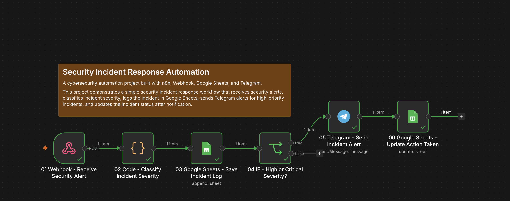
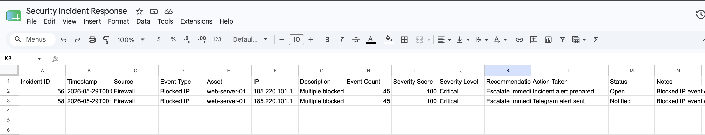

# Security Incident Response Automation

A cybersecurity automation project built with **n8n**, **Webhook**, **Google Sheets**, and **Telegram**.

This project demonstrates a simple security incident response workflow that receives security alerts, classifies incident severity, logs the incident in Google Sheets, sends Telegram alerts for high-priority incidents, and updates the incident status after notification.

---




## Project Overview

The goal of this project is to create a lightweight security incident response automation system.

The workflow receives a security alert through an n8n Webhook, analyzes the event details, calculates a severity score, assigns a severity level, saves the incident in Google Sheets, sends a Telegram alert for high or critical incidents, and updates the incident log after notification.

This project is designed as a practical demo of **security automation**, **incident classification**, **alert triage**, and **basic incident response workflow orchestration**.

---

## Tech Stack

* **n8n Cloud** — workflow automation platform
* **Webhook Trigger** — receives security alerts
* **Code Node** — classifies incident severity
* **Google Sheets** — stores incident logs
* **IF Node** — checks if the incident requires alerting
* **Telegram Bot API** — sends incident alerts

No paid external API is required for this project.

---

## Main Features

### Security Alert Intake

The workflow starts with a Webhook that receives a security alert in JSON format.

Example alert:

```json
{
  "source": "Firewall",
  "eventType": "Blocked IP",
  "asset": "web-server-01",
  "ip": "185.220.101.1",
  "description": "Multiple blocked requests detected from suspicious IP",
  "eventCount": 45
}
```

---

### Automatic Severity Classification

The workflow uses a Code node to calculate a severity score based on:

* event type
* event count
* affected asset
* alert source
* suspicious keywords in the description

The final severity score is capped at `100`.

---

### Severity Levels

The workflow classifies incidents into four levels:

```txt
0 - 34     Low
35 - 64    Medium
65 - 84    High
85 - 100   Critical
```

Only incidents classified as **High** or **Critical** trigger a Telegram alert.

---

### Incident Logging

Every received alert is saved in Google Sheets as an incident record.

Logged fields include:

```txt
Incident ID
Timestamp
Source
Event Type
Asset
IP
Description
Event Count
Severity Score
Severity Level
Recommendation
Action Taken
Status
Notes
```

This creates a simple incident register that can be reviewed later.

---

### Real-Time Telegram Alerting

When an incident is classified as **High** or **Critical**, the workflow sends a Telegram alert.

Example alert:

```txt
🚨 Security Incident Alert

Severity: High
Severity Score: 80/100

Source: Firewall
Event Type: Blocked IP
Asset: web-server-01
IP: 185.220.101.1

Event Count: 45

Description:
Multiple blocked requests detected from suspicious IP

Recommended action:
Investigate immediately, review affected asset logs, validate the source IP, and consider blocking or isolating affected systems.

Status: Open
```

---

### Incident Status Update

After the Telegram alert is sent, the workflow updates the same Google Sheets row:

```txt
Action Taken = Telegram alert sent
Status = Notified
```

This confirms that the incident was escalated.

---

## Workflow Structure

The workflow contains 6 nodes:

```txt
01 Webhook - Receive Security Alert
02 Code - Classify Incident Severity
03 Google Sheets - Save Incident Log
04 IF - High or Critical Severity?
05 Telegram - Send Incident Alert
06 Google Sheets - Update Action Taken
```

---

## Workflow Flow

```txt
01 Webhook - Receive Security Alert
↓
02 Code - Classify Incident Severity
↓
03 Google Sheets - Save Incident Log
↓
04 IF - High or Critical Severity?
   ├── true
   │   ↓
   │   05 Telegram - Send Incident Alert
   │   ↓
   │   06 Google Sheets - Update Action Taken
   └── false
       end
```

---

## Node Details

### 01 Webhook - Receive Security Alert

This node receives the security alert.

Configuration:

```txt
HTTP Method: POST
Path: security-alert
Authentication: None
Respond: Immediately
```

For production use, authentication or a secret header should be added.

---

### 02 Code - Classify Incident Severity

This node analyzes the incoming alert and calculates the incident severity.

It produces:

```txt
incidentId
timestamp
source
eventType
asset
ip
description
eventCount
severityScore
severityLevel
recommendation
actionTaken
status
notes
```

The scoring logic considers:

```txt
Malware-related event type
Data exfiltration
Blocked IP activity
Failed login events
Brute force activity
Privilege escalation
Suspicious process activity
High event count
Critical assets
Suspicious keywords
Security monitoring sources
```

---

### 03 Google Sheets - Save Incident Log

This node saves the incident record in Google Sheets.

Google Sheet name:

```txt
Security Incident Response
```

Tab name:

```txt
Incidents
```

Columns:

```txt
Incident ID
Timestamp
Source
Event Type
Asset
IP
Description
Event Count
Severity Score
Severity Level
Recommendation
Action Taken
Status
Notes
```

Example mappings:

```txt
Incident ID: {{ $json.incidentId }}
Timestamp: {{ $json.timestamp }}
Source: {{ $json.source }}
Event Type: {{ $json.eventType }}
Asset: {{ $json.asset }}
IP: {{ $json.ip }}
Description: {{ $json.description }}
Event Count: {{ $json.eventCount }}
Severity Score: {{ $json.severityScore }}
Severity Level: {{ $json.severityLevel }}
Recommendation: {{ $json.recommendation }}
Action Taken: {{ $json.actionTaken }}
Status: {{ $json.status }}
Notes: {{ $json.notes }}
```

---

### 04 IF - High or Critical Severity?

This node checks if the incident should trigger an alert.

Conditions:

```txt
Severity Level = High
OR
Severity Level = Critical
```

Recommended expression:

```txt
{{ $('02 Code - Classify Incident Severity').item.json.severityLevel }}
```

---

### 05 Telegram - Send Incident Alert

This node sends a Telegram message for high or critical incidents.

Example message:

```txt
🚨 Security Incident Alert

Severity: {{ $('02 Code - Classify Incident Severity').item.json.severityLevel }}
Severity Score: {{ $('02 Code - Classify Incident Severity').item.json.severityScore }}/100

Source: {{ $('02 Code - Classify Incident Severity').item.json.source }}
Event Type: {{ $('02 Code - Classify Incident Severity').item.json.eventType }}
Asset: {{ $('02 Code - Classify Incident Severity').item.json.asset }}
IP: {{ $('02 Code - Classify Incident Severity').item.json.ip }}

Event Count: {{ $('02 Code - Classify Incident Severity').item.json.eventCount }}

Description:
{{ $('02 Code - Classify Incident Severity').item.json.description }}

Reason:
{{ $('02 Code - Classify Incident Severity').item.json.notes }}

Recommended action:
{{ $('02 Code - Classify Incident Severity').item.json.recommendation }}

Status: {{ $('02 Code - Classify Incident Severity').item.json.status }}
```

---

### 06 Google Sheets - Update Action Taken

This node updates the same incident row after sending the Telegram alert.

Column to match:

```txt
Incident ID
```

Match value:

```txt
{{ $('02 Code - Classify Incident Severity').item.json.incidentId }}
```

Updated fields:

```txt
Action Taken: Telegram alert sent
Status: Notified
Notes: {{ $('02 Code - Classify Incident Severity').item.json.notes }} | Telegram alert sent
```

---

## Google Sheets Structure

Google Sheet:

```txt
Security Incident Response
```

Tab:

```txt
Incidents
```

Columns:

```txt
Incident ID
Timestamp
Source
Event Type
Asset
IP
Description
Event Count
Severity Score
Severity Level
Recommendation
Action Taken
Status
Notes
```

Example row:

| Incident ID | Timestamp            | Source   | Event Type | Asset         | IP            | Description                                           | Event Count | Severity Score | Severity Level | Recommendation                                          | Action Taken        | Status   | Notes                     |
| ----------- | -------------------- | -------- | ---------- | ------------- | ------------- | ----------------------------------------------------- | ----------: | -------------: | -------------- | ------------------------------------------------------- | ------------------- | -------- | ------------------------- |
| 51          | 2026-05-29T10:30:00Z | Firewall | Blocked IP | web-server-01 | 185.220.101.1 | Multiple blocked requests detected from suspicious IP |          45 |             80 | High           | Investigate immediately and review affected asset logs. | Telegram alert sent | Notified | Blocked IP event detected |

---

## Test Payloads

### High Severity Test

```json
{
  "source": "Firewall",
  "eventType": "Blocked IP",
  "asset": "web-server-01",
  "ip": "185.220.101.1",
  "description": "Multiple blocked requests detected from suspicious IP",
  "eventCount": 45
}
```

Expected result:

```txt
Incident is logged
Severity is calculated as High
Telegram alert is sent
Google Sheets row is updated to Notified
```

---

### Critical Severity Test

```json
{
  "source": "EDR",
  "eventType": "Malware Detected",
  "asset": "production-db-server",
  "ip": "10.0.0.25",
  "description": "Ransomware behavior detected with possible credential theft and lateral movement",
  "eventCount": 12
}
```

Expected result:

```txt
Incident is logged
Severity is calculated as Critical
Telegram alert is sent
Google Sheets row is updated to Notified
```

---

### Low Severity Test

```json
{
  "source": "Firewall",
  "eventType": "Blocked IP",
  "asset": "test-machine-01",
  "ip": "203.0.113.10",
  "description": "Single blocked request detected",
  "eventCount": 1
}
```

Expected result:

```txt
Incident is logged
Severity is calculated as Low or Medium
No Telegram alert is sent
```

---

## cURL Test Example

Replace the URL with your own n8n test webhook URL.

```bash
curl -X POST "https://YOUR-N8N-DOMAIN.app.n8n.cloud/webhook-test/security-alert" \
-H "Content-Type: application/json" \
-d '{
  "source": "Firewall",
  "eventType": "Blocked IP",
  "asset": "web-server-01",
  "ip": "185.220.101.1",
  "description": "Multiple blocked requests detected from suspicious IP",
  "eventCount": 45
}'
```

---

## Security and Business Value

This project demonstrates a simple incident response automation workflow.

It helps automate repetitive alert triage tasks by:

* receiving structured security alerts
* calculating severity automatically
* logging incidents
* sending real-time alerts for serious incidents
* updating incident status after notification
* reducing manual review time
* improving response speed

This type of workflow can support:

* small IT teams
* freelancers managing client systems
* SOC automation demos
* incident response portfolios
* security alert triage processes
* internal monitoring workflows

---

## Possible Real-World Use Cases

This workflow can be adapted for:

* firewall alerts
* EDR alerts
* SIEM alerts
* failed login alerts
* malware detections
* suspicious IP activity
* cloud security notifications
* server monitoring alerts
* website security events
* internal security operations

---

## Future Improvements

Possible upgrades:

* Add Jira/Trello/Notion ticket creation
* Add Slack or Microsoft Teams alerts
* Add AbuseIPDB IP reputation enrichment
* Add VirusTotal file or URL enrichment
* Add automatic incident assignment
* Add SLA tracking
* Add escalation if status remains open
* Add daily incident summary report
* Add severity-specific response playbooks
* Add duplicate incident detection
* Add webhook authentication
* Add multiple notification channels
* Add dashboard reporting
* Add automatic evidence collection
* Add incident closure workflow

---

## Security Notes

Before using this in production:

* Protect the webhook with authentication or a secret token.
* Validate incoming payloads.
* Do not expose internal IPs or sensitive logs publicly.
* Protect Telegram bot credentials.
* Restrict Google Sheets access.
* Add error handling and retry logic.
* Add alert deduplication.
* Add approval steps before automated containment actions.
* Review privacy and data retention requirements.

---

## Project Status

Current version: working demo

Implemented:

* Webhook security alert intake
* Incident severity scoring
* Severity level classification
* Google Sheets incident logging
* High/Critical severity alerting
* Telegram incident notification
* Google Sheets status update after notification

---

## Author

Built by **Iosif Castrucci**

GitHub: `iosif-castrucci-hub`
Email: `contact.iosifcastrucci@gmail.com`

---

## Disclaimer

This project is a demo cybersecurity automation workflow created for portfolio and educational purposes.

It is not a complete incident response platform and should not be used as the only method for managing security incidents in production environments.

For production use, add authentication, payload validation, logging, escalation rules, error handling, secure credential management, and a formal incident response process.

---

## License

This repository is intended for portfolio and educational purposes.
You may adapt the workflow structure for your own projects.
